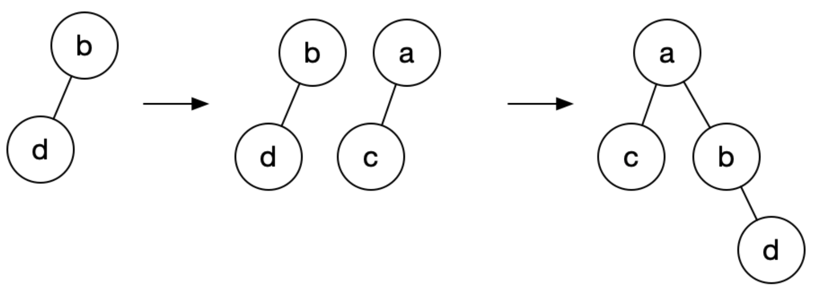
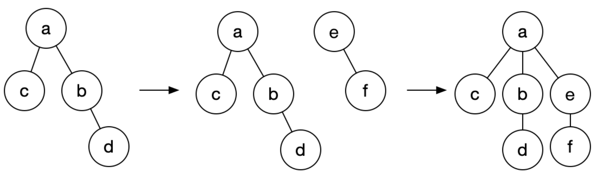

1.无向图中节点连通性问题

原理：

​	将无向图连通节点转换成树，树的根节点为这些连通节点的连通分量标识

步骤：

​	a) 初始化连通分量，初始时所有节点以自身作为独立连通分量，树根节点为自己本身

​	b) 连通a-b时，a所在树根节点更新为b所在树的根节点（为了降低树的高度，使得寻找树根节点更快，小树挂在	大树上）

假设当前有如下连通关系，b-d，a-c，a-b



增加e-f，b-f关系



 

实现：

```java
public class UnionFind {

    private int[] rootNodeIndex;
    private int[] subTreeWeight;
    private int connectedComponentNum;

    public UnionFind(int nodeNum) {
        this.rootNodeIndex = new int[nodeNum];
        this.subTreeWeight = new int[nodeNum];
        this.connectedComponentNum = nodeNum;
        for (int i = 0; i < nodeNum; i++) {
            this.rootNodeIndex[i] = i;
            this.subTreeWeight[i] = 1;
        }
    }

    /**
     * 连通节点A和B
     * @param nodeA
     * @param nodeB
     * @return
     */
    public int connect(int nodeA, int nodeB) {
        if (isConnected(nodeA, nodeB)) {
            return connectedComponentNum;
        } else {
            int nodeARoot = findRootNodeWithCompression(nodeA);
            int nodeBRoot = findRootNodeWithCompression(nodeB);
            if (subTreeWeight[nodeARoot] >= subTreeWeight[nodeBRoot]) {
                rootNodeIndex[nodeBRoot] = nodeARoot;
                subTreeWeight[nodeARoot] += subTreeWeight[nodeBRoot];
            } else {
                rootNodeIndex[nodeARoot] = nodeBRoot;
                subTreeWeight[nodeBRoot] += subTreeWeight[nodeARoot];
            }
            connectedComponentNum--;
            return connectedComponentNum;
        }
    }

    public boolean isConnected(int nodeA, int nodeB) {
        return findRootNodeWithCompression(nodeA) == findRootNodeWithCompression(nodeB);
    }

  	/**
  	 * 无压缩查询根节点
  	 */
    public int findRootNode(int node) {
        int directRootNode = rootNodeIndex[node];
        while (node != directRootNode) {
            node = directRootNode;
            directRootNode = rootNodeIndex[node];
        }
        return directRootNode;
    }

    /**
     * 查找根节点时顺便压缩树深度
     * @param node
     * @return
     */
    public int findRootNodeWithCompression(int node) {
        int directRootNode = rootNodeIndex[node];
        boolean cutoffConnection = false;
        while (node != directRootNode) {
            if (cutoffConnection) {
                subTreeWeight[node]--;
            } else {
                cutoffConnection = true;
            }
            node = directRootNode;
            directRootNode = rootNodeIndex[node];
        }
        return directRootNode;
    }

    public void displayRootIndex() {
        for (int i = 0; i < rootNodeIndex.length; i++) {
            System.out.println(i + "->" + findRootNode(i));
        }
    }

    public void displayNodeWeight() {
        for (int i = 0; i < subTreeWeight.length; i++) {
            System.out.println(i + "->" + subTreeWeight[i]);
        }
    }

    public static void main(String[] args) {
        UnionFind unionFind = new UnionFind(10);
        unionFind.connect(4, 3);
        unionFind.connect(3, 8);
        unionFind.connect(6, 5);
        unionFind.connect(9, 4);
        unionFind.connect(2, 1);
        unionFind.connect(8, 9);
        unionFind.connect(5, 0);
        unionFind.connect(7, 2);
        unionFind.connect(6, 1);
        unionFind.connect(1, 0);
        unionFind.connect(6, 7);
        System.out.println(unionFind.connectedComponentNum);

        unionFind.displayRootIndex();
        System.out.println("======================");
        unionFind.displayNodeWeight();
    }

}
```

