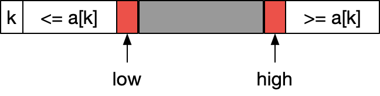
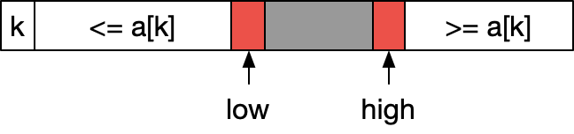
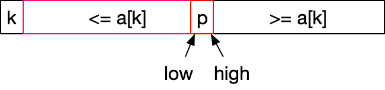
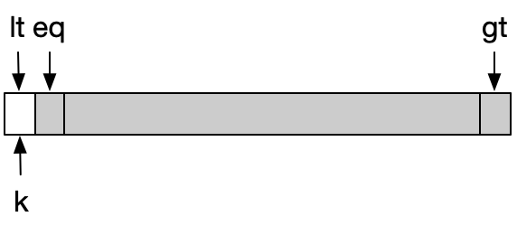

## 原理

1. 寻找元素a[k]所在数组的正确位置p，保证

$$
a[0]...a[p-1] \leq a[k] \leq a[p+1]...a[N]
$$

2. 分治思想，对a[0]...a[p-1]和a[p+1]...a[N]子数组进行排序

## 步骤

1. 选择数组中的一个元素a[k]；
2. 左右指针从数组头尾向中间靠近，原则上保证

$$
a[low] \leq a[k] \leq a[high]
$$

3. 当左右指针均遇到不满足上面条件时，交换指针所指位置元素
4. 重复步骤2，直至左右指针相遇，位置为p
5. a[k]与a[p]交换，数组被分成两个子数组，子数组重复1~4进行排序

比如

找到不满足
$$
a[low] \leq a[k] \leq a[high]
$$


交换a[low]和a[high]后满足要求，low和high指针继续往中心靠近



直到low和high指针相遇（注意，这里要求相遇时，low和high指向同一个元素，且这个元素小于a[k]）



交换a[k]和a[p]，完成步骤1~4

## 实现

```java
public class QuickSort {

    public static void sort(int[] a) {
        subSort(a, 0, a.length-1);
    }

    private static int findPosition(int[] a, int low, int high) {
        // 取头部的好处在于循环体内的比较和交换与a[k]无关，去除a[k]元素，数组还是连续的
        int k = low;
        while (low < high) {
            // 最后一次循环中，可以认为满足条件的p位置已经存在，第一个循环体使low停在比a[k]大的位置，第二个循环体因为low<high，使得high会停在比a[k]大的位置（low==high）
            // 而a[k]需要与比他小的元素交换，下面注释掉的实现是不满足要求的
            /*
            while (low < high && a[low] <= a[k]) {
                low++;
            }
            while (low < high && a[high] >= a[k]) {
                high--;
            }
            */

            // 最后一次循环中，可以认为满足条件的p位置已经存在，第一个循环体使high停在比a[k]小的位置，第二个循环体因为low<high，使得low会停在high的位置
            // 正确的实现方式
            while (low < high && a[high] >= a[k]) {
                high--;
            }
            while (low < high && a[low] <= a[k]) {
                low++;
            }

            swap(a, low, high);
        }
        swap(a, k, low);
        return low;
    }

    private static void subSort(int[] a, int low, int high) {
        if (low >= high) {
            return;
        }
        int p = findPosition(a, low, high);
        subSort(a, low, p-1);
        subSort(a, p+1, high);
    }

    private static void swap(int[] a, int i, int j) {
        int temp = a[i];
        a[i] = a[j];
        a[j] = temp;
    }

    public static void main(String[] args) {
        int[] tc = new int[]{10, 9, 8, 7, 6, 5,4,3,2,1};
        sort(tc);
        System.out.println(Arrays.toString(tc));
    }

}
```

## 性能分析

以比较次数作为性能指标来看，快速排序时间复杂度为
$$
O(n) \sim nlog_2(n)
$$
证明：

对于长度为N的数组，一次subSort的比较次数为C(N)，一次findPosition的比较次数为数组长度N，假设每次找到的位置p正好在数组中间，则
$$
C(N) = 2C(\frac{N}{2}) + N
$$
与归并排序类似，假设
$$
N = 2^n \\
n = log_2(N)
$$
得到
$$
\frac{C(2^n)}{2^n} = \frac{C(2^0)}{2^0} + n \\
C(2^n) = n2^n
C(N) = Nlog_2(N)
$$
但在最坏的情况下，假设每次findPosition都是开头位置，那么subSort只需要处理一个子数组，此时
$$
O(n)=n+(n-1)+...+1 \sim n^2
$$
在出现概率均等的情况下，findPosition的计算位置可能使得子数组长度为[0, N-1]，出现概率为1/N，且两个数组长度之和为N-1，所以有
$$
C(N) = N + \frac{1}{N}[C(0)+C(1)+C(2)+...+C(N-1)] + \frac{1}{N}[C(N-1)+C(N-2)+...+C(0)]
$$

$$
\begin{equation}
\left\{
\begin{array}{l}
    N*C(N) = N^2 + 2sum_{i=0}^{N-1}C(i) \\
    (N-1)*C(N-1) = (N-1)^2 + 2\sum_{i=0}^{N-2}C(i)
\end{array}
\right.
\end{equation}
$$

两式相减，并除以N(N+1)，可得
$$
\frac{C(N)}{N+1} - \frac{C(N-1)}{N} = \frac{2N-1}{N(N+1)} \sim \frac{2}{N+1} \\
\frac{C(N)}{N+1} = \frac{C(N-1)}{N} + \frac{2}{N+1} = ... = 2\sum_{i=1}^{N+1}\frac{1}{i} \sim 2NlnN
$$

## 改进

当出现存在大量重复数值的数组时，快速排序复杂度依然是常数级对数，而三向切分则对重复数值进行集中处理，从而降低子数组的长度，换取<font color='red'>线性复杂度</font>。

三向切分在原快速排序的“小于”，“大于”基础上，增加对“等于”的优化处理。


核心思想是以数组第一个元素为依据，“小于”的堆放在左边，“大于”的堆放在右边，“等于”的放中间，从头开始遍历一遍数组，因此，需要保持3个指针，也是下图中的lt，eq，gt，并且符合如下规则：

1. lt始终指向“小于”元素集外右侧第一个元素；
2. gt始终指向“大于”元素集外左侧第一个元素；
3. eq始终指向“等于”元素集外右侧第一个元素。


初始指针



排序过程

1. 遇到“大于”元素时


2. 遇到“小于”元素时


此时直接进入场景3

3. 遇到“等于”元素时


最终得到


## 实现

```java
public class QuickSortForRepetition {

    public static void sort(int[] a) {
        subSort(a, 0, a.length-1);
    }

    private static void subSort(int[] a, int low, int high) {
        if (low >= high) {
            return;
        }

        // partition方法也可以在这里展开，可以节省返回时数组创建带来的损耗
        int[] partition = partition(a, low, high);
        subSort(a, low, partition[0]);
        subSort(a, partition[1], high);
    }

    private static int[] partition(int[] a, int low, int high) {
        int lt = low;
        int gt = high;
        int eq = low+1;
        int ak = a[low];

        while(eq <= gt) {
            if (a[eq] < ak) {
                swap(a, eq, lt);
                lt++;
            } else if (a[eq] > ak) {
                swap(a, eq, gt);
                gt--;
            } else {
                eq++;
            }
        }

        return new int[]{lt-1, gt+1};
    }


    private static void swap(int[] a, int i, int j) {
        int temp = a[i];
        a[i] = a[j];
        a[j] = temp;
    }

    public static void main(String[] args) {
        int[] tc = new int[]{5, 9, 5, 5, 8, 3, 6, 5, 5, 5, 5, 5, 5, 5, 5, 5, 5, 4, 7, 5, 5, 2, 1};
        sort(tc);
        System.out.println(Arrays.toString(tc));
    }

}
```

## 有重复数组下的性能

<font color='red'>待证明...没证明出来</font>
