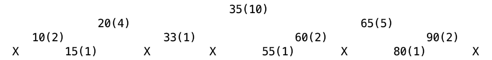

## 1.查找二叉树的出现

想象一下，使用数组和链表实现一个KEY映射一个VALUE，效率是怎样的？

对比以下四种操作的效率，search、insert(存在则false，不存在则插入)、update(存在则更新)、delete(存在则删除)

(1) 数组

| 实现方式/复杂度 | search | insert                                           | update | delete |
| --------------- | ------ | ------------------------------------------------ | ------ | ------ |
| 无序数组        | n      | n+平均n/2移位，<br />存在则false，不存在则insert | n      | n      |
| 有序数组        | lgn    | lgn查询+平均n/2移位 ~ n                          | lgn    | lgn    |

(2) 链表

| 实现方式/复杂度        | search | insert | update | delete |
| ---------------------- | ------ | ------ | ------ | ------ |
| 无序/有序单向/双向链表 | n      | n      | n      | n      |

在这两种数据结构下，search、insert、update、delete操作效率低，于是查找树出现了。

## 2.查找二叉树的性质

1. 左结点的key小于父结点的key；
2. 右节点的key大于父结点的key；
3. 结点的子结点数量不超过2个；
4. 树的key不存在重复；

## 3.实现

1. 定义

   结点数据结构

   ```java
   public abstract class TreeNode<KEY extends Comparable, VALUE> {
       protected KEY key;
       protected VALUE value;
       protected TreeNode lNode;
       protected TreeNode rNode;
       protected int size;
   }
   ```

   树接口定义

   ```java
   // search
   VALUE search(KEY key);
   List<VALUE> search(KEY key, int offset, int limit);
   // insert
   boolean insert(KEY key, VALUE value);
   // update
   boolean update(KEY key, VALUE value);
   // delete
   boolean delete(KEY key);
   // rank
   int rank(KEY key);
   ```

2. 通用方法

   前序遍历

   ```java
   // 前序遍历(根-左-右)
   private List<TreeNode> prevVisit() {
     List<TreeNode> res = new ArrayList<>();
     return prevVisit(rootNode, res);
   }
   private List<TreeNode> prevVisit(TreeNode node, List<TreeNode> ans) {
     if (node == null) {
       return ans;
     }
     ans.add(node);
     prevVisit(node.getlNode(), ans);
     prevVisit(node.getrNode(), ans);
     return ans;
   }
   ```

   中序遍历

   ```java
   // 中序遍历(左-根-右)
   private List<TreeNode> midVisit() {
     List<TreeNode> res = new ArrayList<>();
     return midVisit(rootNode, res);
   }
   private List<TreeNode> midVisit(TreeNode node, List<TreeNode> ans) {
     if (node == null) {
       return ans;
     }
     midVisit(node.getlNode(), ans);
     ans.add(node);
     midVisit(node.getrNode(), ans);
     return ans;
   }
   ```

   后序遍历

   ```java
   // 后序遍历(左-右-根)
   private List<TreeNode> postVisit() {
     List<TreeNode> res = new ArrayList<>();
     return postVisit(rootNode, res);
   }
   private List<TreeNode> postVisit(TreeNode node, List<TreeNode> ans) {
     if (node == null) {
       return ans;
     }
     postVisit(node.getlNode(), ans);
     postVisit(node.getrNode(), ans);
     ans.add(node);
     return ans;
   }
   ```

   水平遍历

   ```java
   private List<TreeNode> horizenVisit(TreeNode rootNode) {
     List<TreeNode> ans = new ArrayList<>();
     if (rootNode == null) {
       return ans;
     }
   
     List<TreeNode> rowNodes = new LinkedList<>();
     rowNodes.add(rootNode);
     while (rowNodes.size() > 0) {
       TreeNode node = rowNodes.remove(0);
       ans.add(node);
       if (node.getlNode() != null) {
         rowNodes.add(node.getlNode());
       }
       if (node.getrNode() != null) {
         rowNodes.add(node.getrNode());
       }
     }
     return ans;
   }
   ```

   绘制二叉树

   ```java
   // 打印二叉树
   public void drawTree() {
    System.out.println("========================================================================");
     StringBuilder treeStr = new StringBuilder();
   
     int height = getHeight();
     final String SPLIT_SYMBOL = "     ";
     List<TreeNode> nodes = new LinkedList<>();
     nodes.add(this.rootNode);
     List<TreeNode> nextNodes = new ArrayList<>();
   
     while (height > 0 && CollectionUtils.isEmpty(nodes) == false) {
       treeStr.append(genSplitSymbol((int) Math.pow(2, height-1) - 1, SPLIT_SYMBOL));
       for (TreeNode node : nodes) {
         if (node != null) {
           treeStr.append(node.getValue() == null ? "  X  " : node.getValue() + "(" + node.getSize() + ")")
             .append(genSplitSymbol((int) Math.pow(2, height)-1, SPLIT_SYMBOL));
           nextNodes.add(node.getlNode());
           nextNodes.add(node.getrNode());
         } else {
           treeStr.append("  X  ").append(genSplitSymbol((int) Math.pow(2, height)-1, SPLIT_SYMBOL));
           nextNodes.add(null);
           nextNodes.add(null);
         }
       }
       treeStr.append("\n");
       nodes.clear();
       nodes.addAll(nextNodes);
       nextNodes.clear();
       height--;
     }
     System.out.println(treeStr.toString());
     System.out.println("========================================================================");
   }
   ```

   树绘制示意图

   

3. search

   ```java
   public VALUE search(KEY key) {
     return search(key, rootNode);
   }
   
   private VALUE search(KEY key, TreeNode<KEY, VALUE> node) {
     if (node == null) {
       return null;
     }
     int compRes = key.compareTo(node.getKey());
     if (compRes > 0) {
       return search(key, (TreeNode<KEY, VALUE>) node.getrNode());
     } else if (compRes < 0) {
       return search(key, (TreeNode<KEY, VALUE>) node.getlNode());
     } else {
       return node.getValue();
     }
   }
   ```

   查找单个key比较简单，因为树的key不重复，所以复杂度只有lg(n)

   ```java
   public List<VALUE> search(KEY key, int offset, int limit) {
     KEY ceilKey = ceil(key);
     if (ceilKey == null) {
       return new ArrayList<>();
     } else {
       List<TreeNode> ans = new ArrayList<>();
       midOrderedVisit(this.rootNode, key, new Limitation(offset, limit), ans);
   
       List<VALUE> res = new ArrayList<>();
       for (TreeNode<KEY, VALUE> node : ans) {
         res.add(node.getValue());
       }
       return res;
     }
   }
   ```

   查找小于等于key的最大key

   ```java
   public KEY floor(KEY key) {
     TreeNode<KEY, VALUE> floorNode = floor(key, rootNode);
     return floorNode != null ? floorNode.getKey() : null;
   }
   
   private TreeNode<KEY, VALUE> floor(KEY key, TreeNode node) {
     if (node == null) {
       return node;
     }
     int compRes = key.compareTo(node.getKey());
     if (compRes > 0) {
       TreeNode floorNode = floor(key, node.getrNode());
       return floorNode == null ? node : floorNode;
     } else if (compRes < 0) {
       return floor(key, node.getlNode());
     } else {
       return node;
     }
   }
   ```

   查找大于等于key的最小key

   ```java
   public KEY ceil(KEY key) {
     TreeNode<KEY, VALUE> ceilNode = ceil(key, rootNode);
     return ceilNode != null ? ceilNode.getKey() : null;
   }
   
   private TreeNode<KEY, VALUE> ceil(KEY key, TreeNode node) {
     if (node == null) {
       return null;
     }
     int compRes = key.compareTo(node.getKey());
     if (compRes > 0) {
       return ceil(key, node.getrNode());
     } else if (compRes < 0) {
       TreeNode ceilNode = ceil(key, node.getlNode());
       return ceilNode == null ? node : ceilNode;
     } else {
       return node;
     }
   }
   ```

4. insert

   insert比较简单，新增的结点必定成为树的叶子结点，沿路需要自增子树的大小。鉴于insert的实现，树的高度与输入数据的顺序有关，请看图

   

   ```java
   public boolean insert(KEY key, VALUE value) {
     TreeNode<KEY, VALUE> node = getNode(key);
     if (node != null) {
       return false;
     }
   
     TreeNode<KEY, VALUE> newNode = new TreeNode<KEY, VALUE>(key, value, null, null, 1) {};
     if (rootNode == null) {
       rootNode = newNode;
       return true;
     } else {
       return insert(newNode, rootNode);
     }
   }
   
   private boolean insert(TreeNode<KEY, VALUE> newNode, TreeNode<KEY, VALUE> node) {
     int compRes = newNode.getKey().compareTo(node.getKey());
     if (compRes > 0) {
       if (node.getrNode() == null) {
         node.setrNode(newNode);
         // 沿路增加子树大小
         node.setSize(node.getSize() + 1);
         return true;
       } else {
         boolean insertRes = insert(newNode, node.getrNode());
         if (insertRes) {
           node.setSize(node.getSize() + 1);
         }
         return insertRes;
       }
     } else if (compRes < 0) {
       if (node.getlNode() == null) {
         node.setlNode(newNode);
         node.setSize(node.getSize() + 1);
         return true;
       } else {
         boolean insertRes = insert(newNode, node.getlNode());
         if (insertRes) {
           node.setSize(node.getSize() + 1);
         }
         return insertRes;
       }
     } else {
       return false;
     }
   }
   ```

5. update

   ```java
   public boolean update(KEY key, VALUE value) {
     TreeNode<KEY, VALUE> node = getNode(key);
     if (node == null) {
       return false;
     } else {
       node.setValue(value);
       return true;
     }
   }
   ```

6. delete

   删除比较复杂，因为需要改变树的结构，这里需要分3种场景进行说明。

   1. 删除子树根结点

      

   2. 删除子树左结点

      

   3. 删除子树右结点

      

   ```java
   public boolean delete(KEY key) {
     boolean res = false;
   
     TreeNode KeyNode = getNode(key);
     if (KeyNode == null) {
       return false;
     }
   
     TreeNode<KEY, VALUE> parentNode = null;
     TreeNode<KEY, VALUE> node = this.rootNode;
     int prevCompRes = 0;
     int compRes;
     while (node != null) {
       compRes = key.compareTo(node.getKey());
       if (compRes > 0) {
         node.setSize(node.getSize() - 1);
         parentNode = node;
         node = node.getrNode();
       } else if (compRes < 0) {
         node.setSize(node.getSize() - 1);
         parentNode = node;
         node = node.getlNode();
       } else {
         TreeNode subsituteNode;
         if (node.getlNode() != null) {
           subsituteNode = deleteMax(node.getlNode());
         } else if (node.getrNode() != null) {
           subsituteNode = deleteMin(node.getrNode());
         } else {
           subsituteNode = null;
         }
   
         if (parentNode == null) {
           this.rootNode = subsituteNode;
         } else {
           // 用subsituteNode替换结点node
           assert prevCompRes != 0;
           if (prevCompRes > 0) {
             parentNode.setrNode(subsituteNode);
           } else if (prevCompRes < 0) {
             parentNode.setlNode(subsituteNode);
           }
         }
         if (subsituteNode != null) {
           subsituteNode.setSize(node.getSize() - 1);
           subsituteNode.setlNode(node.getlNode() == subsituteNode ? subsituteNode.getlNode() : node.getlNode());
           subsituteNode.setrNode(node.getrNode() == subsituteNode ? subsituteNode.getrNode() : node.getrNode());
         }
         res = true;
         break;
       }
       prevCompRes = compRes;
     }
   
     return res;
   }
   ```

   