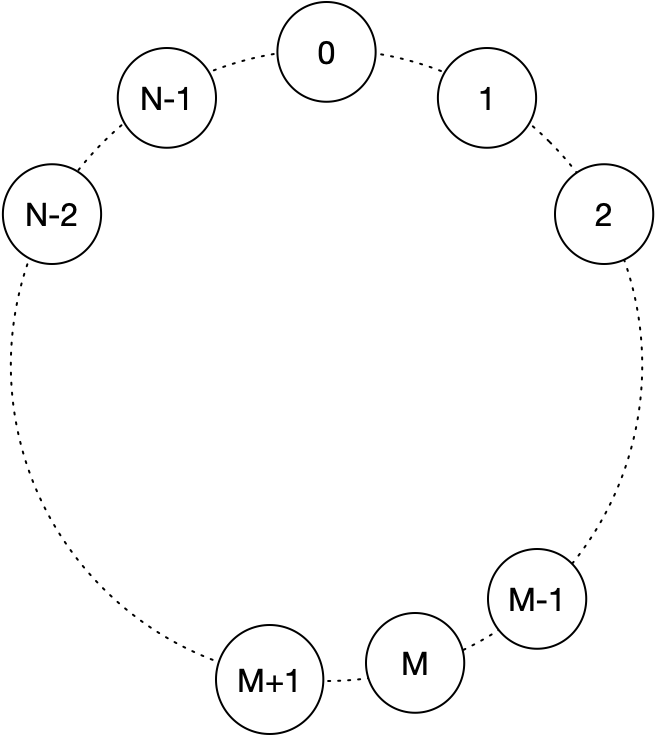
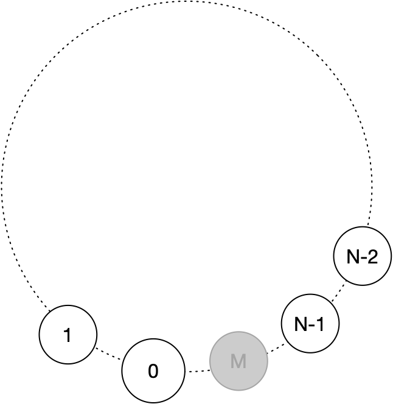

## 1. 定义

约瑟夫环问题：N个节点围成一个环，每隔M-1个节点后去除第M个节点，求最后剩余的节点。

## 2. 思路

### 2.1 递归法

首先对约瑟夫环的节点进行编码；



假设现在去掉第M个节点，如果M>N，则去掉M%N个节点

序列从

n[0], n[1], ..., n[M-1], n[M], n[M+1], ..., n[N-1], n[N]

变为

n[0], n[1], ..., n[M-1], n[M+1], ..., n[N-1], n[N]

将n[M+1]映射到n'[0]重新编码

n'[0], n'[1], ..., n'[N-2], n'[N-1]



比如：

```
N = 10, M = 4
0 1 2 3 4 5 6 7 8 9
第一个节点去掉后
0 1 2   4 5 6 7 8 9
重新编码
6 7 8   0 1 2 3 4 5
```

现在我们定义一个方法，F(n) 是在n个节点的环下，得到的最后剩余的节点号（这个节点号是0~N中的编号）；

显而易见，

F(1) = 0，只有一个节点，剩余节点必定为<font color=red>第0号</font>（在仅有一个节点的环的编号）节点

而拥有k个节点的环，到k-1个节点的环编号间的映射关系为
$$
n_k[p] \equiv n_{k-1}[p-M]
$$
推论
$$
n_{k-1}[p+M] \equiv n_k[p]
$$
因此，得到递推关系
$$
\begin{equation}
\left\{
\begin{array}{l}
F(n) = (F(n-1) + M) \% N \\
F(1) = 0
\end{array}
\right.
\end{equation}
$$

### 2.2 数学法（来自《具体数学》）


