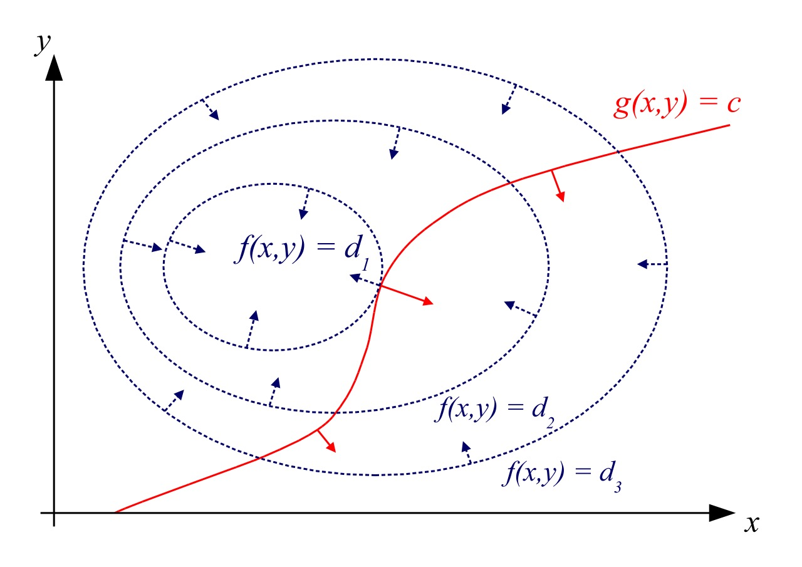
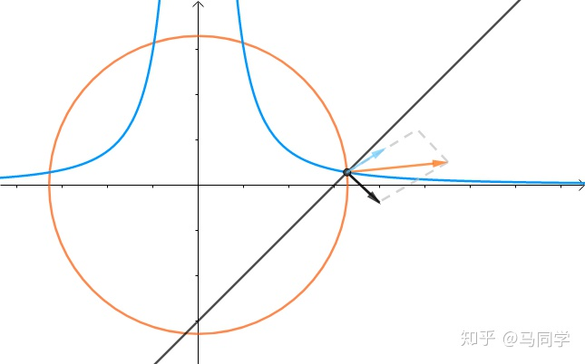
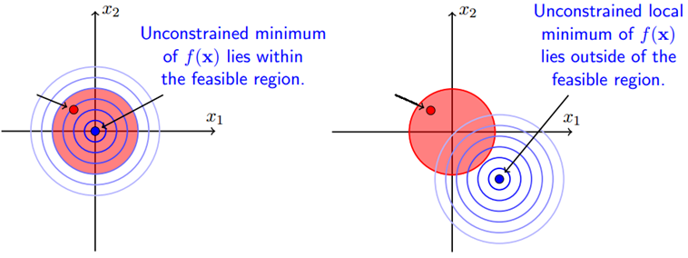

# 1. 简介

对于连续可导函数求极值时，如：
$$
F = f(x)
$$
可知在其导数
$$
f'(x) = 0
$$
所在的x位置，可能存在极值。

如果是多个自变量，则为
$$
z = f(x,y) \\
f_x(x_0,y_0) + f_y(x_0,y_0) = 0 处可能存在极值
$$

> 注意
> 
> 1. 导数为0的位置只是极值存在的必要条件，非充分条件（假设函数F有n个自变量，充分条件需要结合n阶偏导判断）
>    
>    如果需要确定是否存在极值，需要补充正定条件：f是凸函数
>    
>    **凸集定义**：欧式空间中，对于集合中的任意两点的连线，连线上任意一点都在集合中，我们就说这个集合是凸集。
>    
>    **凸函数定义：**对于任意属于[0,1]的a和任意属于凸集的两点x, y，有f( ax + (1-a)y ) <= a * f(x) + (1-a) * f(y)，几何上的直观理解就是两点连线上某点的函数值，大于等于两点之间某点的函数值。凸函数的任一局部极小点也是全局极小点
>    
>    **半正定矩阵的定义：**特征值大于等于0的实对称矩阵。
>    
>    **半正定矩阵的充要条件：**行列式（n阶顺序主子式）等于0，行列式的i阶顺序主子式>=0，i从1到n-1
>    
>    **凸函数的充要条件：**如果f(x)在开凸集S上具有二阶连续偏导数，且f(x)的海塞矩阵（二阶偏导的矩阵）在S上处处半正定，则f(x)为S上的凸函数。
> 
> 2. 极值不代表最值

这种情况下，成为无条件极值求解。

但是，当自变量存在一定关系，如：
$$
x^2y = 3，求x+y极值
$$
拉格朗日乘数法是解决这类条件极值问题的方法。

# 2. 算法解析

拉格朗日乘数法其实是将“条件极值”转化为“无条件极值”问题，这里的“条件”是指“等式限制条件”。

推导思路：（1）代数法（2）几何法

## 2.1 代数法

问题
$$
z = f(x,y) \\
在\varphi(x,y) = 0条件下的极值
$$
假设
$$
由 \varphi(x,y)=0 可得 y=\psi(x)
$$
那么
$$
z = f(x,\psi(x))
$$
z对x求导
$$
\frac{dz}{dx} = \frac{df(x,y)}{dx}+f_y(x,y)*\frac{dy}{dx} = f_x(x,y) + f_y(x,y)*\frac{dy}{dx}
$$
对x，y条件进行隐函数求导
$$
d\varphi(x,y) = \varphi_{x}(x,y)dx + \varphi_{y}(x,y)dy = 0 \\
\frac{dy}{dx} = -\frac{\varphi_x(x,y)}{\varphi_y(x,y)}
$$
当z对x导数为0时，可能存在极值，因此
$$
\frac{dz}{dx} = f_x(x,y) + f_y(x,y)*\frac{dy}{dx} = f_x(x,y)-f_y(x,y)*\frac{\varphi_x(x,y)}{\varphi_y(x,y)} = 0
$$
设定
$$
\lambda = -\frac{f_y(x,y)}{\varphi_y(x,y)}
$$
可得
$$
f_x(x,y)+\lambda*\varphi_x(x,y) = 0
$$
同理可得
$$
f_y(x,y)+\lambda*\varphi_y(x,y) = 0
$$

> 注意，为什么对y求偏导参数也是lambda？
> 
> 因为在极值处，x，y偏导方向上是平行的（见几何法），但是代数上怎么证明呢？

## 2.2 几何法

问题
$$
z = f(x,y) \\
在\varphi(x,y) = 0条件下的极值
$$
假设
$$
z在区域D内连续可导，\varphi(x,y)=0限制了z在平面(x,y)的取值
$$
在取得极值时（假设极值点是x0,y0），两个平面等高线相切，即切线平行，也就是梯度向量（梯度方向垂直与切线方向，即法向量）平行，所以有
$$
\nabla f(x_0,y_0) = \lambda \nabla \varphi(x_0,y_0)
$$
可得
$$
f_x(x_0,y_0)\overrightarrow{x} + f_y(x_0,y_0)\overrightarrow{y} = \lambda{(\varphi_x(x_0,y_0)\overrightarrow{x}+\varphi_y(x_0,y_0)\overrightarrow{y})}
$$
即
$$
\left\{ \begin{array}{l}
f_x(x_0,y_0) = \lambda{\varphi_x(x_0,y_0)} \\
f_y(x_0,y_0) = \lambda{\varphi_y(x_0,y_0)} \\
\varphi(x_0,y_0) = 0
\end{array}\right.
$$
即可求得极值点。

因此，“条件极值”转为“非条件极值”，可以构建新的等式
$$
L(x,y,\lambda) = f(x,y) + \lambda \varphi(x,y)
$$
对新等式求解梯度为0，可得极值结果。

> 求解：为什么极值点必定存在等高线/等高面与约束曲线/曲面相切？只要约束曲线/曲面是光滑可导，就必定存在与其相切的曲线/曲面（理论上是这样的，但怎么证明）。
> 
> 

当多个条件共同约束下，相当于多个约束曲线/曲面的梯度的线性组合与求极值的函数平行

> 求解释：为什么是线性组合？

比如问题为
$$
\left\{ \begin{array}{l}
\varphi(x,y) = 0 \\
g(x,y) = 0 \\
z=f(x,y)求极值
\end{array}\right.
$$
则有联合方程
$$
\left\{ \begin{array}{l}
\nabla f(x_0,y_0) = \lambda \nabla \varphi(x_0,y_0) + \mu \nabla g(x_0,y_0) \\
\varphi(x_0,y_0) = 0 \\
g(x_0,y_0) = 0
\end{array}\right.
$$

# 3. 扩展

* Lagrange乘数法+KKT条件

当条件极值中“条件”由等式条件，变为不等式和等式混合条件，依然可以使用Lagrange乘数法求出可行解。

问题描述
$$
min\ f(\overrightarrow{x}) \\
s.t. g_i(\overrightarrow{x}) \le 0, i=1,...,m \\
h_j(\overrightarrow{x}) = 0, j=m+1,...,n
$$
根据不等式约束条件可以分为两种场景：

> 红色区域是不等式约束条件，蓝色为求极值函数等高线

可行解 𝑥 只能在 𝑔(𝑥)<0 或者 g(x)=0 的区域里取得：

- 当可行解 𝑥 落在 g(x)<0 的区域内，此时直接极小化 𝑓(𝑥) 即可；
- 当可行解 𝑥 落在 g(x)=0 即边界上，此时等价于等式约束优化问题。

因此，可得以下联合方程

Case 1:

$$
\left\{ \begin{array}{l}
g(\overrightarrow{x}) < 0 \\
h(\overrightarrow{x}) = 0 \\
\nabla f(\overrightarrow{x}) + \nabla h(\overrightarrow{x}) = 0
\end{array}\right. \\
$$

Case 2:

$$
\left\{ \begin{array}{l}
g(\overrightarrow{x}) = 0 \\
h(\overrightarrow{x}) = 0 \\
\nabla f(\overrightarrow{x}) + \nabla h(\overrightarrow{x}) + \mu g(\overrightarrow{x}) = 0
\end{array}\right.
$$
