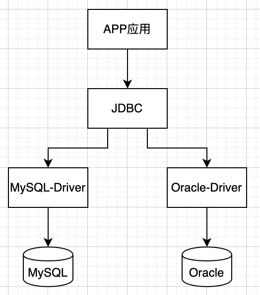

### JDBC

什么是JDBC？JDBC是Java DataBase Connectivity的缩写，它是Java程序访问数据库的标准接口。

使用Java程序访问数据库时，Java代码并不是直接通过TCP连接去访问数据库，而是通过JDBC接口来访问，而JDBC接口则通过JDBC驱动来实现真正对数据库的访问。

例如，我们在Java代码中如果要访问MySQL，那么必须编写代码操作JDBC接口。注意到JDBC接口是Java标准库自带的，所以可以直接编译。而具体的JDBC驱动是由数据库厂商提供的，例如，MySQL的JDBC驱动由Oracle提供。因此，访问某个具体的数据库，我们只需要引入该厂商提供的JDBC驱动，就可以通过JDBC接口来访问，这样保证了Java程序编写的是一套数据库访问代码，却可以访问各种不同的数据库，因为他们都提供了标准的JDBC驱动。

<font color='red'>JDK对外提供的JDBC标准API就在java.sql包内，不同数据库厂家的JDBC驱动都需要实现API提供的接口，其中我们最常用的类涉及：DriverManager、Connection、Statement 和 ResultSet。</font>



APP应用在使用不同厂家数据库时，就可以通过JDBC进行无缝切换，隐藏了不同厂家驱动的使用区别。

```java
static final String JdbcDriver = "com.mysql.jdbc.Driver"; // connector-8.0以上版本请使用: "com.mysql.cj.jdbc.Driver";;
static final String Url = "jdbc:mysql://localhost:3306/test?useSSL=false&serverTimezone=UTC";

//输入连接数据库的用户名与密码
static final String User = "root";//输入你的数据库库名
static final String PassWord = "";//输入你的数据库连接密码

public static void main(String[] args) {
  Connection conn = null;
  Statement stmt = null;
  try {
    // 注册 JDBC 驱动，效果等同DriverManager.registerDriver(new Driver())，Driver是com.mysql.jdbc.Driver类，但推荐用Class.forName，
    // 因为Driver类加载时自动调用一次DriverManager.registerDriver
    Class.forName(JdbcDriver);

    // 打开链接
    System.out.println("连接数据库...");
    conn = DriverManager.getConnection(Url, User, PassWord);

    // 执行查询
    System.out.println("输入sql语句后并执行...");
    stmt = conn.createStatement();
    String sql;
    sql = "select * from test limit 1";// 这里填写需要的sql语句
    //执行sql语句
    ResultSet rs = stmt.executeQuery(sql);

    // 展开结果集数据库
    while (rs.next()) {
      // 通过字段检索
      int id = rs.getInt("id");//获取id值
      String status = rs.getString("status");//获取user_name值
      String uniqVar = rs.getString("uniq_var");//获取sex值

      // 输出数据
      System.out.println("id: " + id);
      System.out.println("status: " + status);
      System.out.println("uniq_var: " + uniqVar);
    }
    // 完成后关闭
    rs.close();
    stmt.close();
    conn.close();
  } catch (SQLException se) {
    // 处理 JDBC 错误
    se.printStackTrace();
  } catch (Exception e) {
    // 处理 Class.forName 错误
    e.printStackTrace();
  } finally {
    // 关闭资源
    try {
      if (stmt != null) stmt.close();
    } catch (SQLException se2) {
    }
    try {
      if (conn != null) conn.close();
    } catch (SQLException se) {
      se.printStackTrace();
    }
  }
  System.out.println("\n执行成功！");
}
```

我们从上面的例子简单梳理一下JDBC的使用模式：

1. 加载一次驱动库

2. 根据dsn（包含地址，用户，密码）创建连接

3. 构造sql和statement

   > :question: PreparedStatement VS Statement ？
   >
   > java.sql.Statement:
   >
   > The object used for executing a static SQL statement and returning the results it produces.
   >
   > Statement可以执行一个静态sql，我们从其中的接口可以看出：
   >
   > 1. executeQuery(String): int
   > 2. executeUpdate(String): int
   >
   > 我们也可以通过com.mysql.jdbc.StatementImpl可以看出执行时，需要重新对sql进行校验、解析、生成packet，然后发送执行并返回结果。
   >
   > ----
   >
   > java.sql.PreparedStatement：
   >
   > A SQL statement is precompiled and stored in a PreparedStatement object. This object can then be used to efficiently execute this statement multiple times.
   >
   > PreparedStatement对sql进行预编译，可以提前校验、解析，参数以占位符形式提供，方便未来以相同的sql指纹，执行不同参数得到不同的结果。

4. 解析结果

5. 释放资源


### 连接池

​        从上面的使用流程，Connection对象在JDBC使用的时候就会去创建一个对象，使用结束以后就会将这个对象给销毁了(close)。每次创建和销毁对象都是耗时操作.，这样做是特别消耗资源的。而复用连接，就可以改善反复创建连接带来的消耗，所以就有了连接池。

常见连接池如下：

| 功能            | dbcp                | druid              | c3p0                               | tomcat-jdbc       | HikariCP                           |
| --------------- | ------------------- | ------------------ | ---------------------------------- | ----------------- | ---------------------------------- |
| 是否支持PSCache | 是                  | 是                 | 是                                 | 否                | 否                                 |
| 监控            | jmx                 | jmx/log/http       | jmx,log                            | jmx               | Jmx                                |
| 扩展性          | 弱                  | 好                 | 弱                                 | 弱                | 弱                                 |
| sql拦截及解析   | 无                  | 支持               | 无                                 | 无                | 无                                 |
| 代码            | 简单                | 中等               | 复杂                               | 简单              | 简单                               |
| 更新时间        | 2019.02             | 2019.05            | 2019.03                            |                   | 2019.02                            |
| 最新版本        | 2.60                | 1.1.17             | 0.9.5.4                            |                   | 3.3.1                              |
| 特点            | 依赖于common-pool   | 阿里开源，功能全面 | 历史久远，代码逻辑复杂，且不易维护 |                   | 优化力度大，功能简单，起源于boneCP |
| 连接池管理      | LinkedBlockingDeque | 数组               |                                    | FairBlockingQueue | threadlocal+CopyOnWriteArrayList   |

1. 性能方面 HikariCP>Druid>tomcat-jdbc>dbcp>c3p0 。hikariCP的高性能得益于最大限度的避免锁竞争。

2. druid功能最为全面，sql拦截等功能，统计数据较为全面，具有良好的扩展性。

3. 综合性能，扩展性等方面，可考虑使用druid或者hikariCP连接池。

4. 可开启prepareStatement缓存，对性能会有大概20%的提升。

连接池也是基于JDBC标准实现，常见的DataSource就是Connection，连接池就是对这些DataSource进行维护。

我们可以看看Druid连接池实现：

#### Druid


> Zebra基于现有的连接池，开发出GroupDataSource，实现主从负载均衡、故障转移、分库分表路由等DataSource，所以Zebra也依赖sql解析器，根据不同的dml类型和查询条件，分发请求到主从和分库中，同时对sql进行适当改写，优化执行效率。
>
> 参考：
>
> 1. com.dianping.zebra.single.pool.DataSourcePoolFactory：Zebra中的一个SingleDataSource视为一个连接池。
> 2. com.dianping.zebra.group.jdbc.GroupDataSource#initDataSources （创建一般的GroupDataSource，里面有主从DataSource）
>
> :leaves: 其实个人认为，Zebra针对分库分表维护二级连接池可能更好，一级连接池以库视为一个总体建立配置最大连接数（连接均摊到各个主从节点），二级连接池从一级连接池中获取连接，从而避免对每个节点按照最大连接数构建连接池，导致：
>
> 1. DB侧连接数随着客户端数量增加，连接数暴涨；
> 2. 客户端维持的连接随DB节点数量增加（比如负载不足增加从库），连接数暴涨；


### ORM

​        解决了连接复用的问题，从连接池获取连接，Statement的构建和ResultSet的解析，回收连接，这些操作均为重复、固定的模板，所以可以固化为一个行为模板（如：MyBatis的SqlSessionTemplate，MyBatis只需要持有DataSource连接池，即可完成连接的申请释放和Stmt的自动创建、缓存和Rs解析）。

​        想要根据不同条件，快速生成执行sql，简化Statement的构建过程，动态sql就应运而生。

> :question: 什么是动态SQL？
>
> 在某种高级语言中，如果嵌入了SQL语句，而这个SQL语句的主体结构已经明确，例如在Java的一段代码中有一个待执行的SQL“select * from t1 where c1>5”，在Java编译阶段，就可以将这段SQL交给数据库管理系统去分析，数据库软件可以对这段SQL进行语法解析，生成数据库方面的可执行代码，这样的SQL称为<font color='red'>静态SQL</font>，即在编译阶段就可以确定数据库要做什么事情。
>
> 而如果嵌入的SQL没有明确给出，如在Java中定义了一个字符串类型的变量sql：String sql;，然后采用preparedStatement对象的execute方法去执行这个sql，该sql的值可能等于从文本框中读取的一个SQL或者从键盘输入的SQL，但具体是什么，在编译时无法确定，只有等到程序运行起来，在执行的过程中才能确定，这种SQL叫做动态SQL。

​        ResultSet的解析，把DB返回的二进制结果反序列为应用层的对象，则是一个泛化的需求。对于Java而言，反射是一个很好的选择。

上面描述的这些需求，就在ORM中一一解决。

​        


